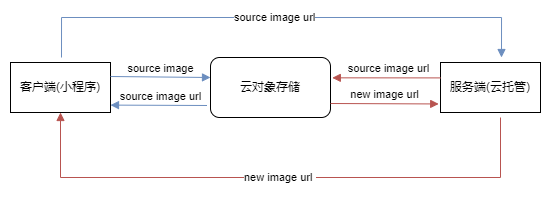

# 关于微信云平台对象存储那点事

最近在鼓捣一个关于图像处理相关的小程序，出于快速开发考虑，在后台开发这块，没有选择走传统的后台部署服务。毕竟，购买云服务器，注册购买域名以及备案等一系列操作下来，也够让人心累。

这次选择的是微信开发的平台的云托管，至于为什么走的不是云函数开发，其中就涉及到了开发语言的选择--python, 如果改用javascript重写一下，成本有点高，所以最终方案选择云托管。

在按照云托管的部署流程一通走下来后，everything is fine. But...

离大谱的，接口请求和响应，居然不能超过1M, 而我这程序就是关于图像处理的，动不动图片大小就会超过1M。如果非要限制用户图片大小限制在1M以下，太过影响用户体验。

此外我还想过，在用户端使用图像压缩，但图像太大压缩也会存在超过1M的情况，另外清晰度也会受到影响。

在微信开发社区和各个IT论坛找了一圈下来，其实没有比较好的解决方案，最终都需要经过一个中间对象存储的过程。

也就是先将图片上传到云上，让后将图片对象的id作为接口入参传入，后台需要使用到图片的时候根据图片id下载即可，然后将处理后的图片，又要上传回云上，返回给客户端新的图片的id，客户端可以根据图片id来获取资源。如下图

<!--  -->
<div align="center">
    
</div>


对象存储云平台其实很多，例如比较有名的比如七牛，阿里，还有腾讯云自己的。我这里采用了微信云对象存储，具体的使用呢可以参考 [微信云托管对象存储](https://developers.weixin.qq.com/minigame/dev/wxcloudrun/src/guide/storage/manage.html)，相应的开发手册可以参考[对象存储-服务端和其他客户端](https://developers.weixin.qq.com/minigame/dev/wxcloudrun/src/development/storage/service/)


为了在后续的开发中更好处理类似的情况，我将微信云托管对象存储做成了一个模块，具体实现情况如下。

首先，需要从自己的小程序或者和云托管平台获取到以下三个重要参数：

- **APPID** ： "your-wechat-appid"
- **SECRET**： "your-wechat-secret"
- **ENV_ID**： "your-cloud-env-id"

- ### 文件上传 (获取token-获取元数据-上传COS)

微信开放平台如果第三方调用对应接口的话，都是需要鉴权了，所以首先我们需要获取到token值。

``` Python
def _refresh_access_token(self):
        """获取或刷新access_token"""
        url = "https://api.weixin.qq.com/cgi-bin/token"
        params = {
            "grant_type": "client_credential",
            "appid": self.appid,
            "secret": self.secret
        }
        response = requests.get(url, params=params, verify=False).json()
        if 'access_token' in response:
            self.access_token = response['access_token']
            self.token_expires = time.time() + response['expires_in'] - 300  # 提前5分钟刷新
        else:
            raise Exception(f"获取access_token失败: {response}")
```


文件上传可以分成2步：**1获取上传元数据，2上传文件到COS**。

获取元数据可以理解为向平台发送请求，获取一个用来存放一个文件（存储对象）的一个URL地址, 上传文件到COS可以则可以理解成将资源放到上一步生成的URL地址上，经此，文件才算真正的上传成功了。

``` Python
    def upload_file(self, local_path, cloud_path):
        """
        上传本地文件到微信云存储
        :param local_path: 本地文件路径
        :param cloud_path: 云端存储路径（如：'images/example.jpg'）
        :return: 文件ID（用于后续下载）
        """
        self._ensure_access_token()
        
        # 1. 获取上传元数据
        upload_meta_url = "https://api.weixin.qq.com/tcb/uploadfile"
        params = {"access_token": self.access_token}
        payload = {"env": self.env, "path": cloud_path}
        response = requests.post(upload_meta_url, params=params, json=payload,verify=False).json()
        print(payload, params)
        if response.get('errcode', 0) != 0:
            raise Exception(f"上传元数据获取失败: {response}")
        
        # 2. 上传文件到COS
        cos_url = response['url']
       
        key = cloud_path.split('/')[-1]
        print(key)
        files = {
            "Signature":(None,response['authorization']),
            "x-cos-meta-fileid": (None, response['cos_file_id']),
            "x-cos-security-token": (None,response['token']),
            "key": (None, cloud_path),
            'file':(key, open(local_path, 'rb')),
        }

        upload_resp = requests.post(cos_url, files=files, verify=False)
        if upload_resp.status_code != 204:
            raise Exception(f"COS上传失败: {upload_resp.text}", upload_resp)
       
        return response['file_id']
```


- ### 文件下载

下载文件相对简单一些，直接调用微信开放平台对外提供的批量下载接口，当然对应的token也是需要的，这部分就不做赘述，代码实现可以参考下方。

``` Python 

def download_file(self, file_id, local_path):
        """
        从微信云存储下载文件
        :param file_id: 文件ID（上传时返回的file_id）
        :param local_path: 本地存储路径
        """
        self._ensure_access_token()
        
        # 1. 获取下载链接
        download_meta_url = "https://api.weixin.qq.com/tcb/batchdownloadfile"
        params = {"access_token": self.access_token}
        payload = {
            "env": self.env,
            "file_list": [{"fileid": file_id, "max_age": 7200}]
        }
        response = requests.post(download_meta_url, params=params, json=payload, verify=False).json()
        
        if response.get('errcode', 0) != 0:
            raise Exception(f"下载元数据获取失败: {response}")
        
        file_info = response['file_list'][0]
        if file_info['status'] != 0:
            raise Exception(f"下载错误: {file_info['errmsg']}")
        
        # 2. 下载文件
        download_resp = requests.get(file_info['download_url'], verify=False)
        if download_resp.status_code != 200:
            raise Exception("文件下载失败")
        
        with open(local_path, 'wb') as f:
            f.write(download_resp.content)
            
        return True
```

以上就是微信云托管上对象存储的上传和下载的实现了。为了方便，我们可以将功能在一个类中实现。此外，考虑到token获取接口是有限制的，每天的调用次数是2000次，而每个token的有效时间是2小时，因此可以重复利用已有token。

最终，完整的代码实现如下：

``` Python
# wx-cloud-storage.py
# description: 微信云托管对象存储管理模块
import requests
import time

class WeChatCloudStorage:
    def __init__(self, appid, secret, env):
        self.appid = appid
        self.secret = secret
        self.env = env
        self.access_token = None
        self.token_expires = 0  # Token过期时间戳

    def _refresh_access_token(self):
        """获取或刷新access_token"""
        url = "https://api.weixin.qq.com/cgi-bin/token"
        params = {
            "grant_type": "client_credential",
            "appid": self.appid,
            "secret": self.secret
        }
        response = requests.get(url, params=params, verify=False).json()
        if 'access_token' in response:
            self.access_token = response['access_token']
            self.token_expires = time.time() + response['expires_in'] - 300  # 提前5分钟刷新
        else:
            raise Exception(f"获取access_token失败: {response}")

    def _ensure_access_token(self):
        """确保access_token有效"""
        if time.time() >= self.token_expires or not self.access_token:
            self._refresh_access_token()

    def upload_file(self, local_path, cloud_path):
        """
        上传本地文件到微信云存储
        :param local_path: 本地文件路径
        :param cloud_path: 云端存储路径（如：'images/example.jpg'）
        :return: 文件ID（用于后续下载）
        """
        self._ensure_access_token()
        
        # 1. 获取上传元数据
        upload_meta_url = "https://api.weixin.qq.com/tcb/uploadfile"
        params = {"access_token": self.access_token}
        payload = {"env": self.env, "path": cloud_path}
        response = requests.post(upload_meta_url, params=params, json=payload,verify=False).json()
        print(payload, params)
        if response.get('errcode', 0) != 0:
            raise Exception(f"上传元数据获取失败: {response}")
        
        # 2. 上传文件到COS
        cos_url = response['url']
       
        key = cloud_path.split('/')[-1]
        print(key)
        files = {
            "Signature":(None,response['authorization']),
            "x-cos-meta-fileid": (None, response['cos_file_id']),
            "x-cos-security-token": (None,response['token']),
            "key": (None, cloud_path),
            'file':(key, open(local_path, 'rb')),
        }

        upload_resp = requests.post(cos_url, files=files, verify=False)
        if upload_resp.status_code != 204:
            raise Exception(f"COS上传失败: {upload_resp.text}", upload_resp)
       
        return response['file_id']

    def download_file(self, file_id, local_path):
        """
        从微信云存储下载文件
        :param file_id: 文件ID（上传时返回的file_id）
        :param local_path: 本地存储路径
        """
        self._ensure_access_token()
        
        # 1. 获取下载链接
        download_meta_url = "https://api.weixin.qq.com/tcb/batchdownloadfile"
        params = {"access_token": self.access_token}
        payload = {
            "env": self.env,
            "file_list": [{"fileid": file_id, "max_age": 7200}]
        }
        response = requests.post(download_meta_url, params=params, json=payload, verify=False).json()
        
        if response.get('errcode', 0) != 0:
            raise Exception(f"下载元数据获取失败: {response}")
        
        file_info = response['file_list'][0]
        if file_info['status'] != 0:
            raise Exception(f"下载错误: {file_info['errmsg']}")
        
        # 2. 下载文件
        download_resp = requests.get(file_info['download_url'], verify=False)
        if download_resp.status_code != 200:
            raise Exception("文件下载失败")
        
        with open(local_path, 'wb') as f:
            f.write(download_resp.content)
            
        return True

# 使用示例
if __name__ == "__main__":
    # 配置信息（需要替换为实际值）
    APPID = "your-wechat-appid"
    SECRET = "your-wechat-secret"
    ENV_ID = "your-cloud-env-id"
   
    # 上传示例
    storage = WeChatCloudStorage(APPID, SECRET, ENV_ID)
    try:
        file_id = storage.upload_file("../test.png", "image/test2.png")
        print(f"文件上传成功，File ID: {file_id}")
    except Exception as e:
        print(f"上传失败: {e}")
    # 下载示例
    try:
        storage.download_file(file_id, "downloaded_image.jpg")
        print("文件下载成功")
    except Exception as e:
        print(f"下载失败: {e}")


```

以上就是关于对象存储管理相关的内容了，如果你在开发类似的功能过程中有类似的idea或者遇到一些难搞的坑，欢迎一起讨论。